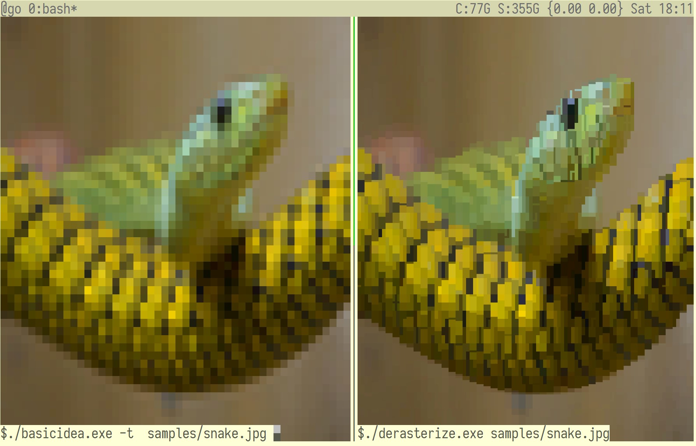

This program converts pictures into Unicode text with Ansi colors for display
within a terminal. It performs lots of AVX2 optimized math to deliver the best
quality on modern terminals with 24-bit color support, e.g. Kitty, Gnome Terminal,
CMD.EXE, mintty, mlterm, etc. 

Here's how it compares to the previous best, [hiptext](https://github.com/jart/hiptext):



Not so bad considering the original image is:


## Getting Started

You just need `cc` and `convert` on the PATH. Windows users can get that
from Cygwin, MSYS2, or WSL. Mac users can try Homebrew.

On Windows/msys2:
```bash
pacman -S msys/gcc mingw64/mingw-w64-x86_64-imagemagick
export PATH=$PATH:/mingw64/bin/
```

On Debian and Ubuntu:
```bash
apt-get install build-essential imagemagick
``` 

Then run:
```bash
./derasterize.c samples/lemur.png
```
