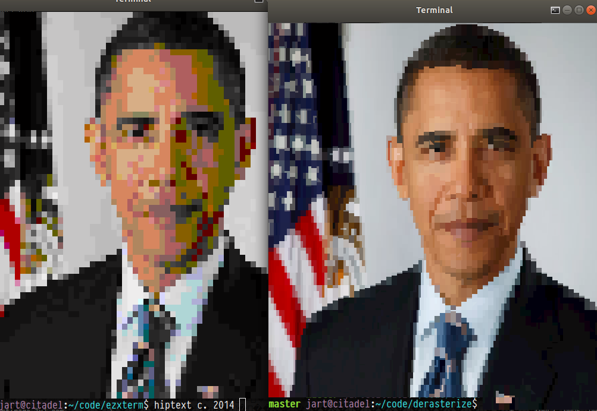

This script converts things like photographs into UNICODE text with ANSI
colors for display within a terminal. It performs lots of AVX2 optimized
math to deliver the best quality on modern terminals with 24-bit color
support, e.g. Kitty, Gnome Terminal, CMD.EXE, etc. 

Here's how it compares to [hiptext](https://github.com/jart/hiptext):



## Getting Started

You just need `cc` and `convert` on the PATH. Windows users can get that
from Cygwin, MSYS2, or WSL. Mac users can try Homebrew. Ubuntu users can
`apt install build-essential imagemagick`. Then run the script:

```bash
./derasterize.c lemur.png
```
